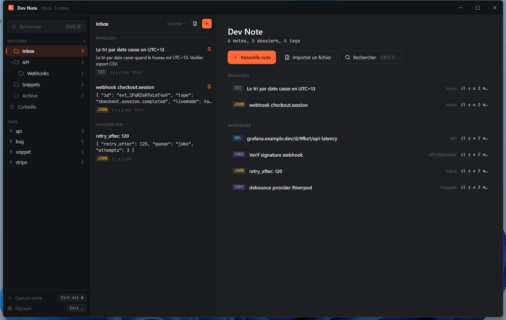
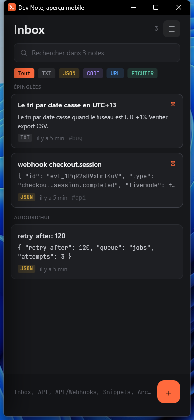

# Dev Note

Capture et retrouve tes notes de dev en quelques secondes. Fichiers Markdown en clair, recherche FTS5 instantanée, détection automatique du type. Desktop d'abord, 100 % hors ligne.





> Les captures utilisent un coffre de démonstration, pas de vraies notes.

## Pourquoi

Un webhook à relire, une clé d'API de staging, un bout de SQL qui a marché une fois. Ça finit dans un `sans-titre-3.txt`, dans un canal Slack avec soi-même, ou nulle part.

Dev Note tient sur deux promesses et refuse tout ce qui les ralentit :

- **Écrire vite**, un raccourci global ouvre une fenêtre de capture par-dessus n'importe quelle application. Coller, fermer. Rien à ranger, rien à nommer : le titre et le type sont déduits.
- **Retrouver vite**, `Ctrl K` cherche dans le corps de toutes les notes, pas dans un aperçu tronqué. Les badges de type et la coloration syntaxique font le reste à l'œil.

Ces deux exigences ont tranché tous les arbitrages : pas de confirmation superflue, pas de dialogue bloquant, les erreurs de fichiers passent par un bandeau discret plutôt qu'une modale.

## Ce qui le distingue

**Vos notes sont des fichiers `.md` en clair.** Un fichier par note, frontmatter YAML en tête, contenu brut dessous. Lisibles avec `cat`, versionnables avec git, éditables avec n'importe quoi. L'index SQLite n'est qu'un cache : supprimez-le, il se reconstruit depuis les fichiers.

**La recherche est un vrai moteur.** SQLite FTS5, et non un filtre sur ce qui est déjà à l'écran, sur desktop comme sur mobile.

**L'application ne contacte aucun serveur.** Pas de compte, pas de télémétrie, pas de synchronisation. Ce qui est sur votre disque y reste.

## Fonctionnalités

**Capture** : fenêtre dédiée sur raccourci global, pré-remplissage depuis le presse-papier, dossier de destination configurable, fermeture automatique après enregistrement.

**Types** : `TXT`, `JSON`, `CODE`, `URL`, plus `FICHIER` pour les pièces jointes. Détection à la frappe, surchargeable à la main. Le JSON se plie et se déplie par nœud, le code est coloré.

**Import de fichiers** : glissez-les sur la fenêtre, ou passez par le sélecteur, plusieurs à la fois. Tout ce qui est du texte (JSON, CSV, XML, YAML, code, logs) devient une note dont le contenu est **indexé et cherchable**. Le reste, PDF, binaires, est copié dans le coffre et référencé. Dans les deux cas, « Enregistrer sous » vous rend le fichier sous son nom d'origine.

**Organisation** : dossiers imbriqués, tags, épinglage, corbeille avec restauration et purge automatique. Un dossier parent affiche et compte ce qu'il contient, sous-dossiers compris.

**Apparence** : trois thèmes (Anthracite, Noir profond, Clair), suivi du système, cinq accents, taille de texte réglable. Changement instantané.

## Sauvegarde

Il n'y a pas d'intégration Google Drive, et c'est délibéré : **l'emplacement du coffre est configurable**.

Réglages → Stockage → Emplacement → *Changer…*, et pointez-le dans un dossier que Google Drive, OneDrive ou Dropbox synchronise déjà. Vous obtenez une sauvegarde continue et versionnée, avec restauration par l'interface de votre fournisseur, sans compte à connecter, sans OAuth, sans rien à maintenir ici.

Deux options au moment du changement : **déplacer** vos notes vers le nouveau dossier (l'ancien n'est vidé qu'une fois la copie vérifiée fichier par fichier), ou **utiliser** un dossier existant tel quel, ce qu'il faut quand votre client cloud a déjà restauré le coffre sur une autre machine.

## Raccourcis

Tous remappables dans Réglages → Raccourcis.

| | |
|---|---|
| `Ctrl Alt N` | capture rapide, global, fonctionne hors de l'application |
| `Ctrl Alt V` | coller le presse-papier en note, global |
| `Ctrl Maj J` | afficher / masquer la fenêtre, global |
| `Ctrl K` | palette de recherche |
| `Ctrl N` | nouvelle note |
| `Ctrl P` | épingler |
| `Ctrl .` | plier / déplier tout le JSON |
| `Échap` | fermer la note, revenir à l'accueil |

## Le coffre

Les notes vivent dans `~/JotVault/`, un sous-dossier par dossier de l'application. Les fichiers font foi.

```markdown
---
id: "ab6bb229-3db9-4e37-9b52-c789ccb99aa8"
title: "webhook checkout.session"
type: json
tags: ["api", "stripe"]
folder: "Enko/Webhooks"
created: 2026-07-28T09:12:00.000
modified: 2026-07-30T15:55:50.000
pinned: true
---
{ "id": "evt_1PqR2sK9xLmT4uV", "type": "checkout.session.completed" }
```

Un `.md` déposé à la main sans frontmatter est lu quand même : le titre vient du premier titre ou de la première ligne, le type est deviné, le dossier vient du chemin.

Deux dossiers cachés à la racine : `.trash/` pour les notes supprimées en attente de purge, `.attachments/` pour les binaires importés. Ni l'un ni l'autre n'apparaît comme dossier dans l'application.

Au premier lancement, et uniquement si le coffre n'existait pas, quelques notes d'exemple sont créées.

## Recherche

Une base SQLite (`drift`) avec une table FTS5, tenue à jour par un `watcher` sur le coffre. Toute création, modification ou suppression de fichier, y compris depuis un autre éditeur, met l'index à jour en ~220 ms.

La requête combine deux passes :

1. **FTS5** en préfixe, rapide et classée par pertinence ;
2. **sous-chaîne**, parce qu'on cherche `hook` pour trouver `webhook_failed`, ce qu'une recherche par tokens ne peut structurellement pas rendre.

Il n'y a **pas de debounce** sur la frappe : sur quelques centaines de notes la requête coûte quelques millisecondes, et attendre 150 ms est exactement la friction que cette application existe pour supprimer.

Si l'index est absent, corrompu ou d'un schéma périmé, il est supprimé et reconstruit intégralement, un cache cassé n'est jamais une raison de faire échouer un démarrage.

## Compiler

Flutter 3.44 ou plus récent.

```bash
flutter pub get
flutter run -d windows
```

Version distribuable :

```bash
flutter build windows --release
```

Le résultat est dans `build/windows/x64/runner/Release/`. **Distribuez le dossier entier**, pas seulement le `.exe` : il a besoin de `data/` et des DLL à côté de lui.

Autres plateformes :

```bash
flutter build linux --release              # depuis un hôte Linux : pas de compilation croisée
flutter build apk --release --split-per-abi
```

Sous Linux il faut les dépendances GTK habituelles plus `libayatana-appindicator3-dev` pour l'icône de notification, et `libsqlite3-0` sur la machine cible.

Aperçu de l'interface mobile sans émulateur, en fenêtre 390×844 :

```bash
flutter run -d windows --dart-define=JOT_FORCE_MOBILE=true
```

## État par plateforme

| Plateforme | État |
|---|---|
| Windows | construit et utilisé |
| Android | compile ; jamais lancé sur un appareil réel |
| Linux | tous les plugins ont une implémentation ; jamais construit |
| macOS | jamais construit |

## Architecture

| Écran | Dossier |
|---|---|
| Fenêtre principale, 3 colonnes | `features/main_window/` |
| Palette de recherche | `features/search_palette/` |
| Capture rapide, fenêtre séparée | `features/quick_capture/` |
| Interface mobile | `features/mobile/` |
| Zone de notification | `features/tray/` |
| Import / export | `features/import/` |

La capture rapide est une vraie fenêtre système (`desktop_multi_window`) avec son propre moteur Flutter : elle n'a besoin ni de l'index ni du watcher, elle écrit un fichier et se ferme. Si la plateforme refuse de créer la fenêtre, l'application bascule sur un panneau interne, la capture est la seule chose qui ne doit jamais être indisponible.

Le thème vient de `core/theme/` : `jot_palette.dart` porte les trois palettes, `jot_colors.dart` expose la palette active, `jot_metrics.dart` les dimensions. JetBrains Mono est embarquée (SIL OFL 1.1, voir `assets/fonts/OFL.txt`) pour que le JSON et le code s'affichent à l'identique partout.

## Développement

```bash
flutter test               # 43 tests
flutter analyze
dart run build_runner build   # après toute modification des tables drift
python tool/make_logo.py      # regénère les .ico et PNG du logo
```

Les tests portent volontairement sur la couche qui touche vos fichiers : import, export, déplacement du coffre, corbeille, arbre de dossiers, aller-retour du frontmatter. C'est là qu'une régression coûte des données plutôt qu'un pixel.

`packages/desktop_drop/` est une copie de la version 0.7.1 publiée, amputée de ses implémentations Android, iOS et web : celles-ci appliquent l'ancien Kotlin Gradle Plugin, ce qui cassait `flutter build apk` alors que le glisser-déposer n'existe que sur desktop. Le détail est en tête de son `pubspec.yaml`.

## Limites connues

- Le canal de mise à jour et l'installation automatique, dans À propos, ne font rien : l'application ne contacte aucun serveur.
- Le menu de la zone de notification n'a pas été vérifié à l'écran.
- Sous Wayland, les raccourcis globaux sont bridés par le système ; la capture rapide se rabat sur le panneau interne.
- Le coffre s'appelle toujours `JotVault`, nom d'origine du projet. Le renommer déplacerait vos notes : c'est à faire soi-même via le changement d'emplacement.

## Licence

MIT, voir [LICENSE](LICENSE).

JetBrains Mono est distribuée sous SIL Open Font License 1.1 (`assets/fonts/OFL.txt`), les icônes Lucide sous ISC, et `packages/desktop_drop/` reste sous la licence MIT de son auteur d'origine.
